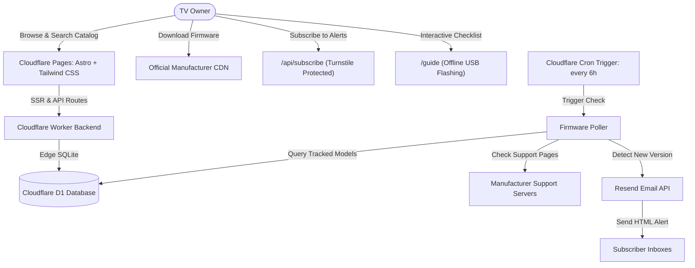

# OwnTheGlass 🛡️📺

> **"You paid for the panel. Own the glass."**  
> *Keep your TV private, offline, and up to date.*

An open-source, privacy-first web platform hosted on **Cloudflare Pages / Workers**. **OwnTheGlass** empowers display owners to treat their smart TVs as pristine, air-gapped monitors without sacrificing picture quality, gaming VRR fixes, or critical panel firmware.

Inspired by technical investigations into smart TV telemetry, network scanning, and ambient surveillance (such as [Gamers Nexus's *"216,000,000 Spy TVs | The LG Smart TV Problem"*](https://www.youtube.com/watch?v=6IFVTcM28KA&t=3932s)), OwnTheGlass provides the tools to keep your TV disconnected from Wi-Fi and Ethernet while keeping its firmware fully up to date via official, verified offline USB updates.

---

## ✨ Features

- **🛡️ 100% Air-Gapped TV Philosophy**: Complete guidance on treating your TV as a dumb display (paired with an external streamer like Apple TV 4K or NVIDIA Shield) with zero telemetry and zero local network scanning.
- **⚡ Direct Official CDN Downloads**: One-click download links pointing directly to uncompressed official firmware `.zip` packages straight from manufacturer CDNs (`gscs-b2c.lge.com`).
- **📋 Interactive USB Flashing Guide (`/guide`)**:
  - Live pre-flight preparation checklist with progress bar.
  - Step-by-step formatting instructions (FAT32/NTFS required; why exFAT/APFS fail).
  - Folder structure verification (`LG_DTV` root directory requirement).
  - Troubleshooting FAQ for common flashing issues.
- **🔔 Model-Specific Email Alerts**:
  - Powered by **Resend** with a dark-mode, responsive email template.
  - Delivered the moment new firmware is published for your exact TV model.
  - Protected by **Cloudflare Turnstile** bot verification.
  - Includes RFC-compliant 1-click unsubscribe links.
- **🔍 Catalog Search & Real-Time Manufacturer Validation**:
  - Search across pre-seeded OLED, QNED, and 4K series (CX, C1, C2, C3, C4, G3, G4, B4).
  - Add any new TV model code with real-time manufacturer API validation that rejects fake or invalid model numbers immediately.
- **⛅ Cloudflare-Native Serverless Edge**:
  - Built on **Astro 5** with `@astrojs/cloudflare`.
  - **Cloudflare D1**: Serverless edge SQLite database for models, subscribers, and check logs.
  - **Cloudflare Cron Triggers**: Scheduled poller runs every 6 hours to inspect upstream support pages and dispatch notifications automatically.
- **🐳 Preserved Homelab Daemon**: For users who still want a local background daemon with NTFY push alerts, the original Python container is preserved in `homelab/`.

---

## 🏛️ Architecture



---

## 🚀 Quick Start (Local Development)

### 1. Prerequisites
- **Node.js**: v20 or higher (v22 recommended)
- **npm**: v9 or higher

### 2. Install Dependencies
```bash
npm install
```

### 3. Initialize Local Cloudflare D1 Database
Apply the database schema migration to your local SQLite D1 environment:
```bash
npm run d1:migrate:local
```

### 4. Seed TV Models Catalog
Populate the database with pre-curated LG OLED and QNED models:
```bash
npm run seed:local
```

### 5. Start Development Server
```bash
npm run dev
```
Open **[http://localhost:4321](http://localhost:4321)** in your browser.

---

## 🧪 Testing & Verification

Run automated validation tests (verifies version parsing, version comparison logic, and real-time manufacturer model validation/rejection):
```bash
npx tsx tests/test_validation.mjs
```

Verify production Astro build:
```bash
npm run build
```

---

## ⛅ Deploying to Cloudflare

### 1. Create Remote Cloudflare D1 Database
Authenticate with Wrangler and create your production database:
```bash
npx wrangler d1 create owntheglass-db
```
Copy the generated `database_id` and update `wrangler.jsonc`:
```jsonc
"d1_databases": [
  {
    "binding": "DB",
    "database_name": "owntheglass-db",
    "database_id": "<YOUR_D1_DATABASE_ID>"
  }
]
```

### 2. Apply Migrations to Remote D1
```bash
npm run d1:migrate:remote
```

### 3. Configure Secrets in Cloudflare
Set your Resend API key and optional Turnstile keys:
```bash
npx wrangler secret put RESEND_API_KEY
# Enter your Resend API key (starts with re_...)

npx wrangler secret put TURNSTILE_SECRET_KEY
# Enter your Cloudflare Turnstile secret key (optional for local, recommended for prod)

npx wrangler secret put CRON_SECRET
# Enter an optional secret token for manual /api/cron/check invocations
```

### 4. Deploy to Cloudflare Pages
You can connect this GitHub repository directly to **Cloudflare Pages** in the Cloudflare Dashboard:
- **Framework preset**: `Astro`
- **Build command**: `npm run build`
- **Build output directory**: `dist`
- **Compatibility flags**: `nodejs_compat`
- **D1 Database Binding**: Link `DB` to `owntheglass-db`

Or deploy directly via CLI:
```bash
npx wrangler pages deploy dist
```

---

## 📁 Repository Structure

```text
.
├── astro.config.mjs          # Astro 5 configuration with Cloudflare adapter
├── wrangler.jsonc            # Cloudflare Pages, D1 binding & Cron trigger config
├── package.json              # Project dependencies and scripts
├── migrations/
│   └── 0001_initial_schema.sql # Cloudflare D1 SQLite database schema
├── data/
│   └── seed_models.json      # Pre-curated TV catalog (LG CX, C1-C4, G3-G4, B4)
├── scripts/
│   └── seed_db.mjs           # Local D1 seeding utility
├── tests/
│   └── test_validation.mjs   # Model validation & version comparison tests
├── src/
│   ├── layouts/
│   │   └── Layout.astro      # Master layout (dark OLED theme, nav, footer)
│   ├── components/
│   │   ├── ModelCard.astro   # TV model card with firmware info & action buttons
│   │   ├── SubscribeModal.astro # Email subscription modal with Turnstile bot check
│   │   └── AddModelModal.astro  # Live model request modal with validation
│   ├── lib/
│   │   ├── db.ts             # Typed D1 database query functions
│   │   ├── email.ts          # Resend dispatcher & dark-mode HTML template
│   │   ├── turnstile.ts      # Cloudflare Turnstile verification helper
│   │   └── brands/           # Multi-brand architecture
│   │       ├── types.ts      # BrandAdapter interface definitions
│   │       ├── lg.ts         # Edge-compatible LG parser & API validator
│   │       └── index.ts      # Multi-brand registry (LG, TCL, Vizio, Samsung)
│   └── pages/
│       ├── index.astro       # Homepage (Air-Gap manifesto, search, model grid)
│       ├── guide.astro       # Interactive offline USB flashing guide & checklist
│       ├── 404.astro         # Custom 404 page
│       ├── unsubscribe.astro # Unsubscribe confirmation page
│       ├── models/
│       │   └── [id].astro    # Model detail page & historical version changelog
│       └── api/
│           ├── models/
│           │   ├── search.ts # Search & autocomplete API
│           │   └── add.ts    # Model ingestion & live validation API
│           ├── subscribe.ts  # Email subscription handler
│           ├── unsubscribe.ts# 1-click unsubscribe handler
│           └── cron/
│               └── check.ts  # Scheduled poller (runs every 6h)
└── homelab/                  # Standalone Python daemon for local Docker + NTFY
    ├── Dockerfile
    ├── docker-compose.yml
    ├── requirements.txt
    ├── main.py
    └── src/
```

---

## 🔒 Security & Privacy

- **Zero TV Connection**: All updates are installed via standard USB drive into the TV's `LG_DTV` directory. Your TV never needs to join a Wi-Fi or Ethernet network.
- **Genuine Checksums & Official CDNs**: Download links route directly to official manufacturer update servers (`https://gscs-b2c.lge.com/downloadFile?fileId=...`). Files are never modified or re-hosted.
- **Privacy-First Alerts**: Email subscriptions require only an email address and TV model. No trackers, no passwords, and every email includes a guaranteed 1-click unsubscribe link.

---

## 📄 License & Disclaimer

MIT License.

*Disclaimer: OwnTheGlass is an independent open-source project and is not affiliated with, sponsored by, or endorsed by LG Electronics, TCL, Vizio, Samsung, or Sony. All product names, logos, and brands are property of their respective owners.*
